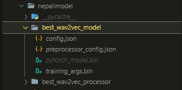
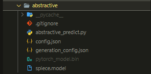
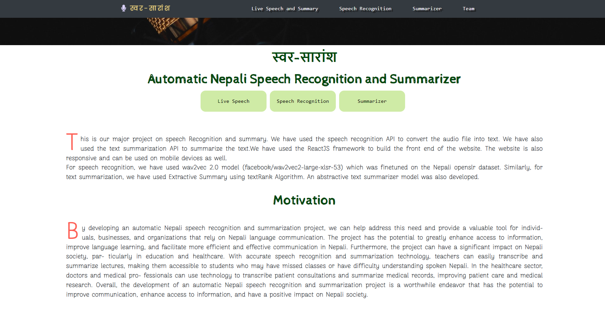
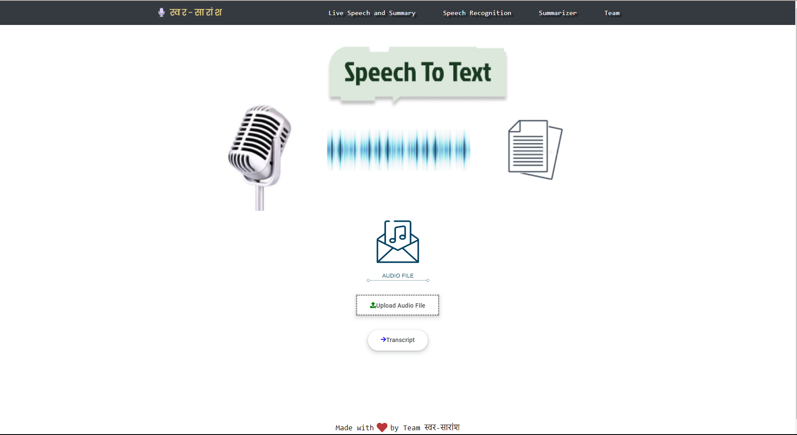
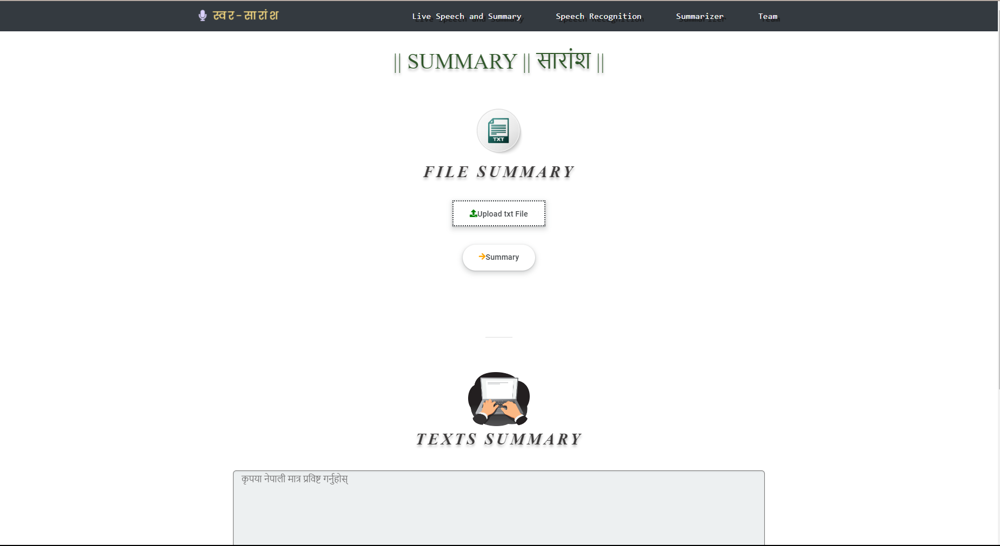
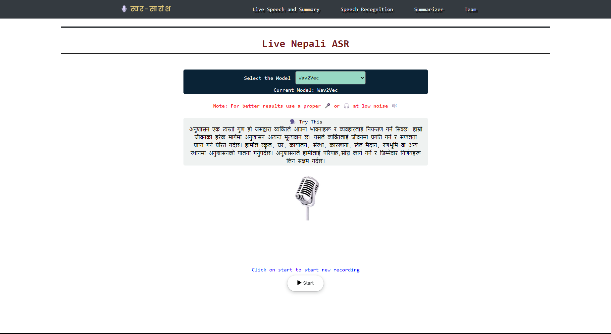
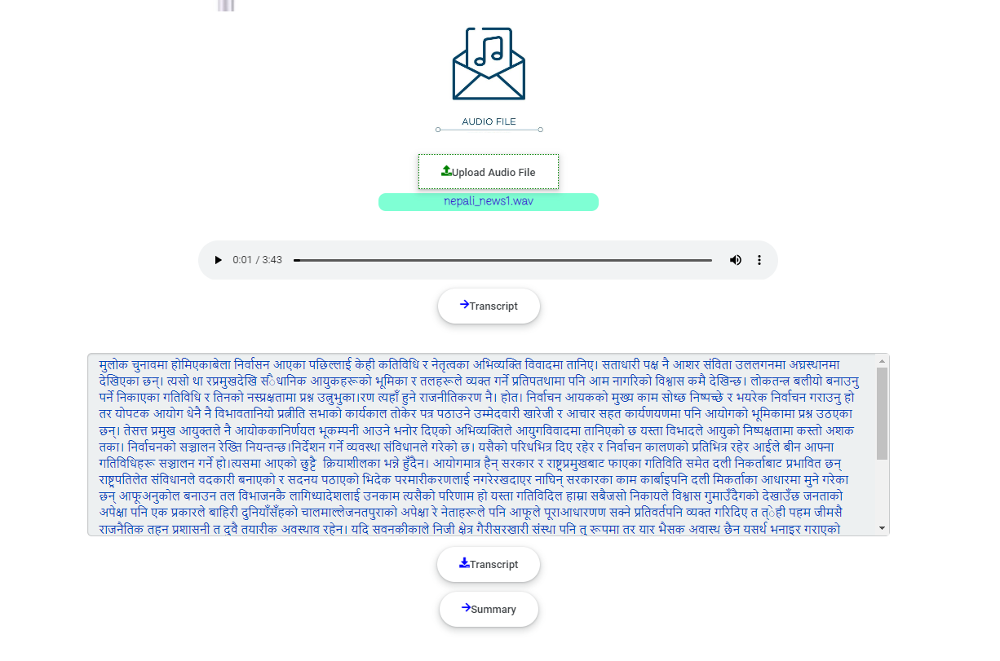
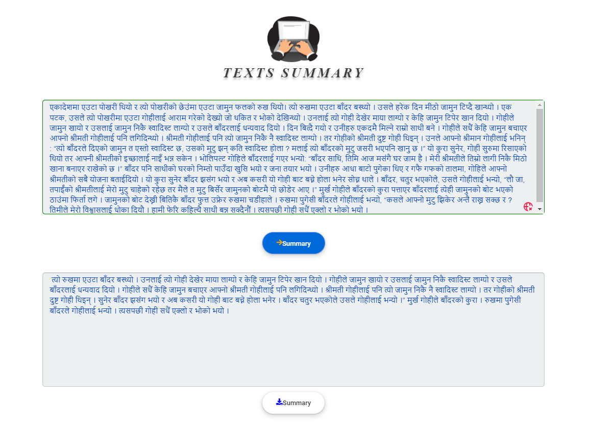
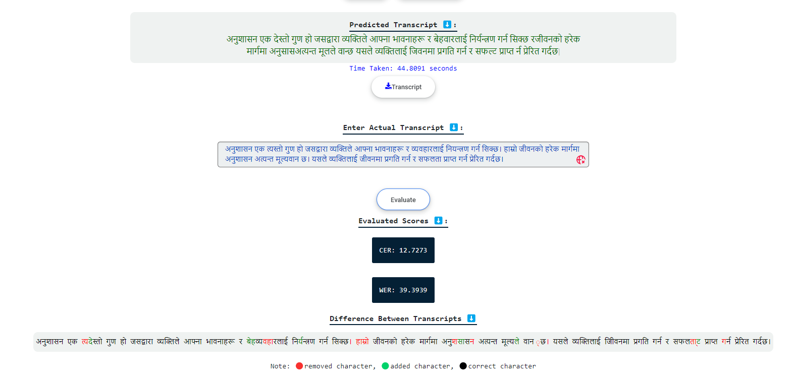

# **Swar-Saransha** ~ An Automatic Nepali Speech Recognition and Summarizer System
## About This Project
A system which can convert Nepali speech to text and generate summary of text developed as major project for final year of computer engineering. This project introduces an innovative Nepali speech recognition and summarizer system that has the potential to revolutionize the way we process and analyze spoken information. Our system leverages the power of deep learning algorithms, including CNN, Resnet, BiLSTM, and wav2vec2, to transcribe speech into text with remarkable accuracy and speed. Additionally, the summarizer component of our system employs advanced natural language processing techniques, such as the TextRank Algorithm and Transformer mt5, to condense lengthy speeches into concise and informative summaries, making it easier to digest large amounts of information. This system has significant applications for various fields, including journalism, legal transcription, and business meetings. By streamlining the process of speech transcription and information extraction, our system can save time, increase productivity, and improve the overall quality of speech-to-text analysis.

<hr>

## Motivation Behind This Project
The Nepali language is spoken by more than 17 million people worldwide, making it one of the most widely spoken languages in South Asia. However, there is a significant need for automated speech recognition and summarization tools for
Nepali, as there are currently limited options available for accurately transcribing and summarizing Nepali speech. By developing **Swar-Saransha**, we aim to address this need and provide a valuable tool for individuals, businesses, and organizations that rely on Nepali language communication. The project has the potential to greatly enhance access to information, improve language learning, and facilitate more efficient and effective communication in Nepal.

<hr>

## Features
- Nepali Speech Recognition that generates transcript from input speech
- Nepali Speech Summarization that generates summary from the generated transcript
- Options to download the generated transcript and summary
- Simple UI to perform automatic speech recognition and summarization

<hr>

## Tools and Technologies Used:
- **For Deep Learning** ~ Python, Keras, Huggingface Transformers, Pytorch, Librosa, pandas, numpy, matplotlib
- **For Designs and Diagrams** ~ Figma, StarUML
- **For Frontend** ~ React JS, Bootstrap, HTML, CSS, JS
- **For Backend** ~ Python, FastAPI
- **For Coding** ~ Microsoft VS Code, Google Colaboratory, Kaggle
- **For Version Contol** ~ GitHub
- **For Documentation** ~ OverLeaf, Notion, Google Docs, Canva
- **For Project Management** ~ ClickUp

<hr>

## Steps to setup and run the Swar Saransha web app in your local machine
1. Clone this repo
```
git clone https://github.com/JuJu2181/Automatic-Nepali-Speech-Recognition-and-Summarizer.git
```
2. Create virtual environment using Python version 3.9.10 and use it for the project
```
python -m venv myenv
```
> P.S:  "If you use some other Python versions you may face dependency errors when installing the requirements so it is advised to use Python 3.9.10"
3. Install all the requirements from requirements.txt
```
pip install -r requirements.txt
```
4. For setting up Backend navigate to backend folder
```
cd Web_App/backend
```
5. Download files for wav2vec2 model from [here](https://huggingface.co/anish-shilpakar/wav2vec2-nepali-asr-v1) and place the files inside "nepalimodel/best_wav2vec_model" folder.  
Your directory structure should look like this ⬇️  

6. Download files for Abstractive summarizer from [here](https://huggingface.co/Anjaan-Khadka/Nepali-Summarization) and place the files inside "abstractive" folder.  
Your directory structure should look like this ⬇️  

7. Run this command to start backend server
```
uvicorn api:app --reload
```
8. For frontend, open a new terminal and navigate to the frontend folder
```
cd Web_App/frontend
```
6. Make sure you have react installed in your computer, then run following command to install all necessary react packages.
```
npm install --force
```
7. To open the webapp run frontend server while still keeping the backend server running
```
npm start
```
8. In the frontend once you get Model Load Success notification as in image below, you are all set to go and start using the webapp to perform speech recognition and summarization.

9. Check out the demo video below to learn more about how to use the web app.

<hr>

## Demo Video for Web App

https://user-images.githubusercontent.com/43902648/225966400-c21ca1e0-4499-4bd0-8ca7-a64e0bc3e0e0.mp4

<hr>

## Screen Shots For Web App
### 1. Home Page 

### 2. Speech Recognition From File 

### 3. Summarizer 

### 4. Live Speech 

### 5. Speech Recognition Output

### 5. Summarizer Output

### 5. Evaluation of Transcript


<hr>

## Directory Structure
- Training folder has all files needed for model training
- Web_App folder has all files needed for webapp(frontend and backend included) for real time testing

<hr>

## Project Members
[Anish Shilpakar](https://github.com/JuJu2181)  
[Anjaan Khadka](https://github.com/AnjaanKhadka)  
[Sudip Shrestha](https://github.com/sudips413)  
[Sachin Manandhar](https://github.com/sachin035) 


***
*Feel Free to contact us if you want to know more about how we trained and integrated these models.*
